### 금 ETF 비교

-   GLD : 순수 금으로 구성되어있는 ETF
    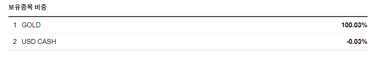

-   GDX : 순수 금으로 구성되어있는 ETF
    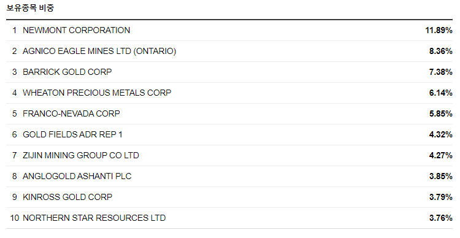

---

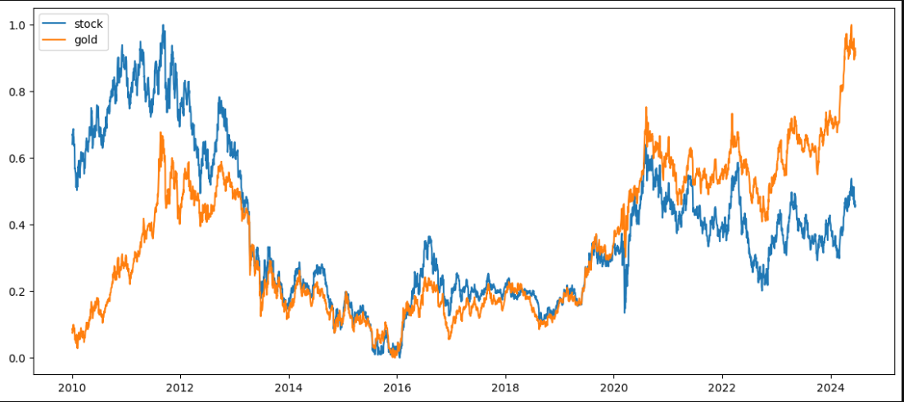
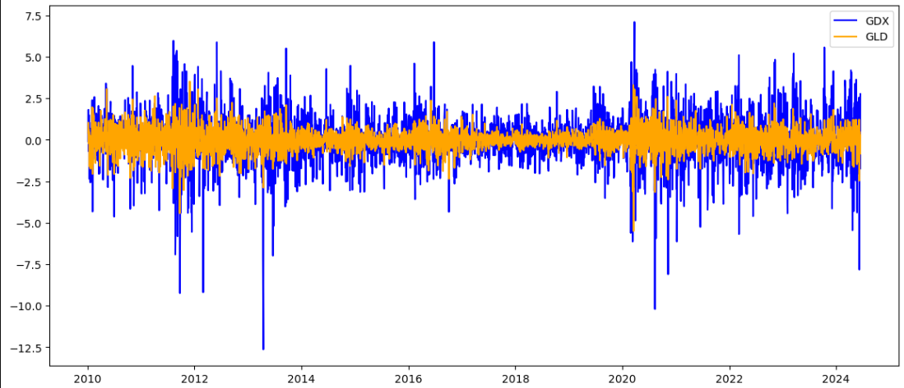

> 전체적인 변동폭이 현물이 보다 안정적이며 가치도 지속적으로 상승

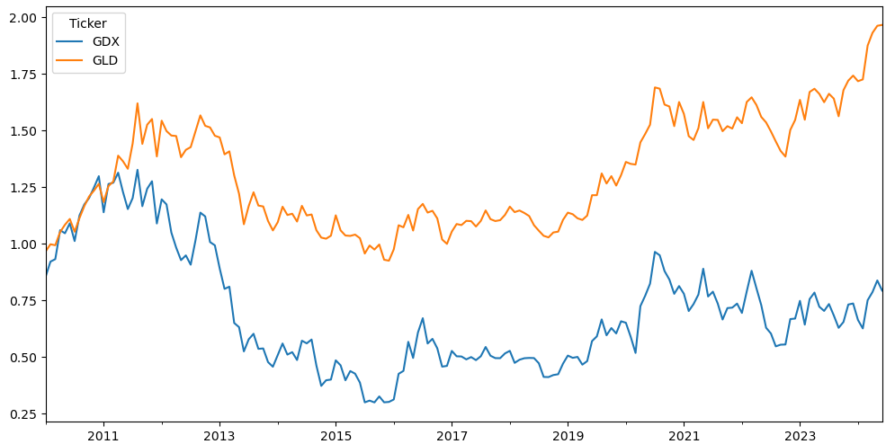

---

<details>
  <summary>ACF, PACF</summary>
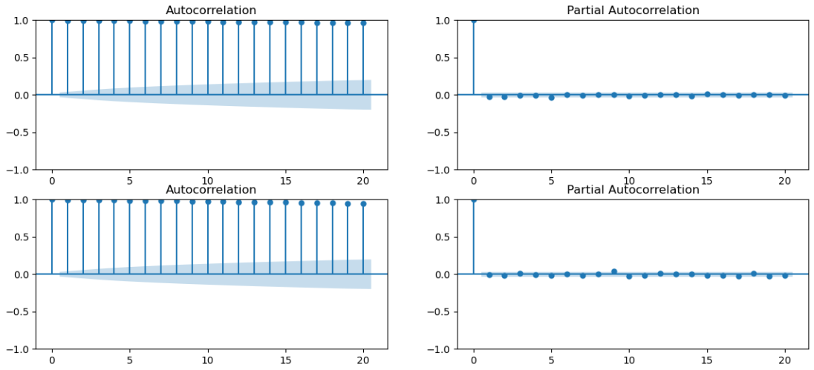

> 정상성을 보이고 있으며 AR은 1이 적합해보임

</details>
<details>
  <summary>ndiffs, auto_arima</summary>

```python

from pmdarima.arima import ndiffs
# KPSS(Kwaiatkowski-Phillips-Schmidt-Shin)
# 차분을 진행하는 것이 필요할 지 결정하기 위해 사용하는 한 가지 검정 방법
# 영가설(귀무가설)을 "데이터에 정상성이 나타난다."로 설정한 뒤
# 영가설이 거짓이라는 증거를 찾는 알고리즘이다.
kpss_diffs = ndiffs(g_y_train, alpha=0.05, test='kpss', max_d=6)
adf_diffs = ndiffs(g_y_train, alpha=0.05, test='adf', max_d=6)
pp_diffs = ndiffs(g_y_train, alpha=0.05, test='pp', max_d=6)

n_diffs = max(kpss_diffs, adf_diffs, pp_diffs)

print(f'd = {n_diffs}')

d = 1

```

```python

import pmdarima as pm

model = pm.auto_arima(y=s_y_train,
                      d=1,
                      start_p=0, max_p=10,
                      start_q=0, max_q=10,
                      m=1, seasonal=False,
                      stepwise=True,
                      trace=True)

Best model:  ARIMA(0,1,0)(0,0,0)[0]

```

</details>

### summary

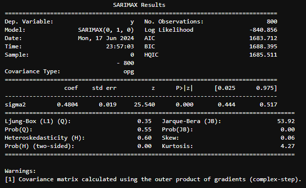
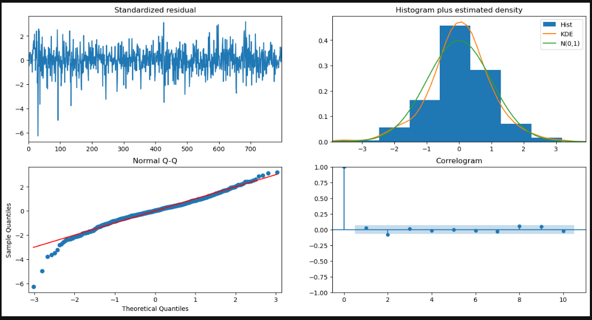

```
# Prob(Q), 융-박스 검정 통계량
# 0.05 이상: 서로 독립이고 동일한 분포를 따른다.

# Prob(H), 이분산성 검정 통계량
# 0.05 이상: 잔차의 분산이 일정하다.

# Prob(JB), 자크-베라 검정 통계량
# 0.05 이상: 일정한 평균과 분산을 따른다.

# Skew(쏠린 정도, 왜도)
# 0에 가까워야 한다.

# Kurtosis(뾰족한 정도, 첨도)
# 3에 가까워야 한다.

서로 독립적고 동일한 분포를 가지고있지만, 잔차의 분산이 일정하지 못하고
일정한 평균과 분산을 가지고있지 않다.
첨도는 3에 가까운 편이여 적절하고
왜도는 0에 매우 가까운 수치로 적절하다.
```

-   predict -> 모델성능검사
    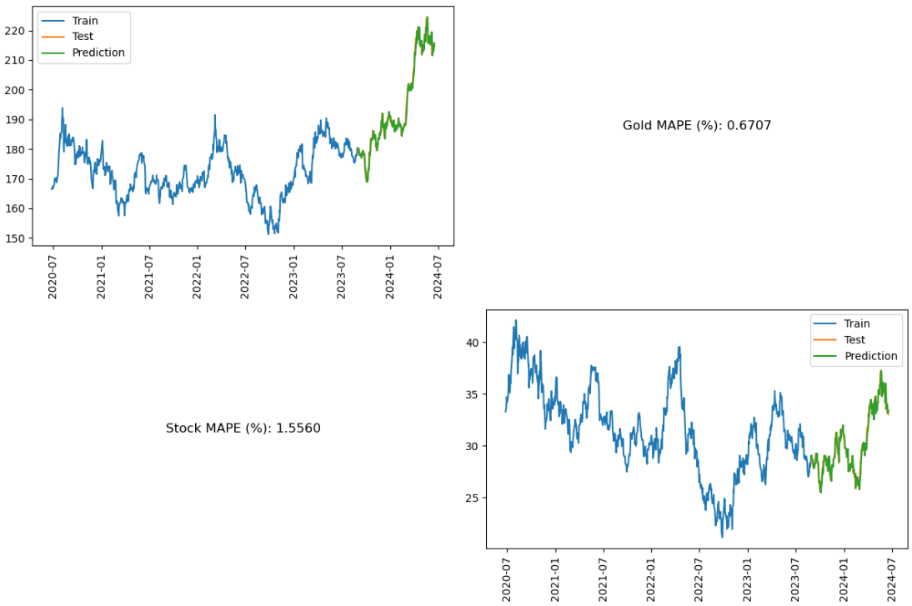

---

### Prophet

<details>
  <summary>fit</summary>

```python
from prophet import Prophet
from prophet.diagnostics import cross_validation, performance_metrics
import itertools
import pandas as pd
import matplotlib.pyplot as plt

# changepoint_prior_scale: trend의 변화하는 크기를 반영하는 정도이다, 0.05가 default
# seasonality_prior_scale: 계절성을 반영하는 단위이다.
# seasonality_mode: 계절성으로 나타나는 효과를 더해 나갈지, 곱해 나갈지 정한다.
search_space = {
    'changepoint_prior_scale': [0.05, 0.1, 0.5, 1.0, 5.0, 10.0],
    'seasonality_prior_scale': [0.05, 0.1, 1.0, 10.0],
    'seasonality_mode': ['additive', 'multiplicative']
}

# itertools.product(): 각 요소들의 모든 경우의 수 조합으로 생성
param_combinded = [dict(zip(search_space.keys(), v)) for v in itertools.product(*search_space.values())]

train_len = int(len(g_df) * 0.8)
test_len = int(len(g_df) * 0.2)

train_size = f'{train_len} days'
test_size = f'{test_len} days'
train_df = g_df.iloc[: train_len]
test_df = g_df.iloc[train_len: ]

mapes = []
for param in param_combinded:
    model = Prophet(**param)
    model.fit(train_df)

    # 'threads' 옵션은 메모리 사용량은 낮지만 CPU 바운드 작업에는 효과적이지 않을 수 있다.
    # 'dask' 옵션은 대규모의 데이터를 처리하는 데 효과적이다.
    # 'processes' 옵션은 각각의 작업을 별도의 프로세스로 실행하기 때문에 CPU 바운드 작업에 효과적이지만,
    # 메모리 사용량이 높을 수 있다.
    cv_df = cross_validation(model, initial=train_size, period='20 days', horizon=test_size, parallel='processes')
    df_p = performance_metrics(cv_df, rolling_window=1)
    mapes.append(df_p['mape'].values[0])

tuning_result = pd.DataFrame(param_combinded)
tuning_result['mape'] = mapes

```

```python
s_tuning_result.sort_values(by='s_mape')
```

```python

# 일단 여기 값 위에꺼 보고 수정해야 합니다.
# 10.00	0.10	additive
model = Prophet(changepoint_prior_scale=10,
                seasonality_prior_scale=0.1,
                seasonality_mode='additive')
model.fit(g_df)
future = model.make_future_dataframe(periods=365)
forecast = model.predict(future)
# 뒤에 일정 조절해서 오늘 날짜랑 비교해봅시다.
# forecast[['ds', 'yhat', 'yhat_lower', 'yhat_upper']][1370:]

```

</details>

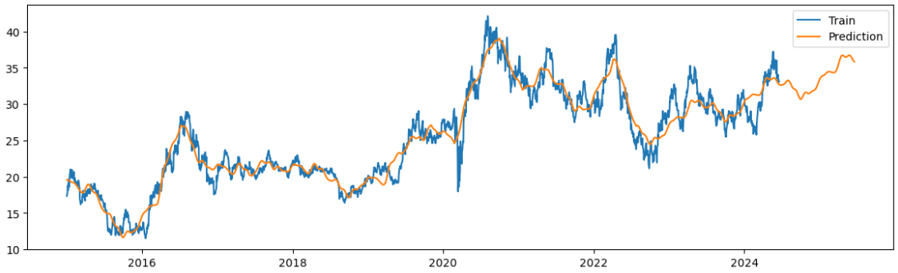
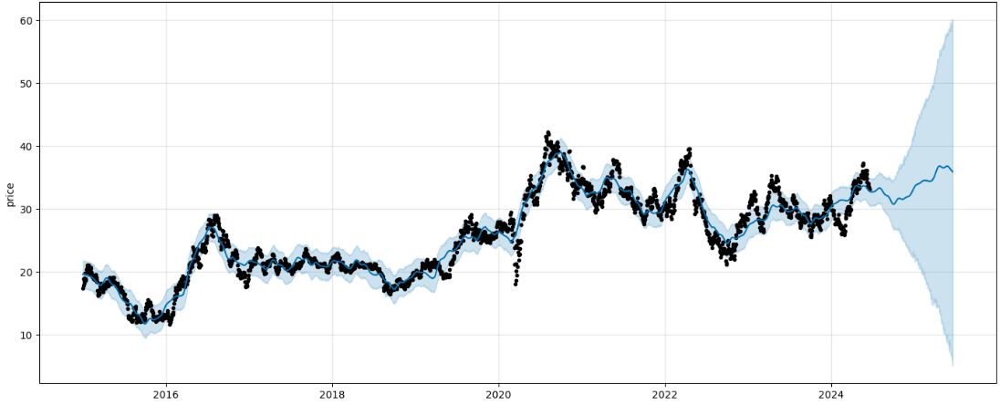
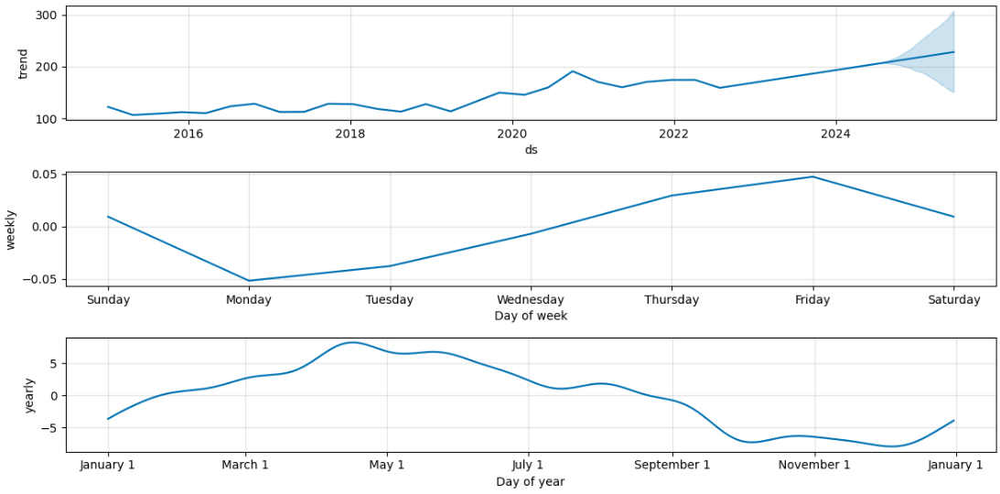

> 월요일부터 가격이 차근차근 올라가다 주말에 다시 원점으로 돌아오는걸 볼수있음  
> 10 ~ 11월에 사서 4 ~ 5월에 파는것이 최선으로 보임

---

### ETF 수익률 비교

-   GLD : 순수 금으로 구성되어있는 ETF
-   GDX : 순수 금으로 구성되어있는 ETF

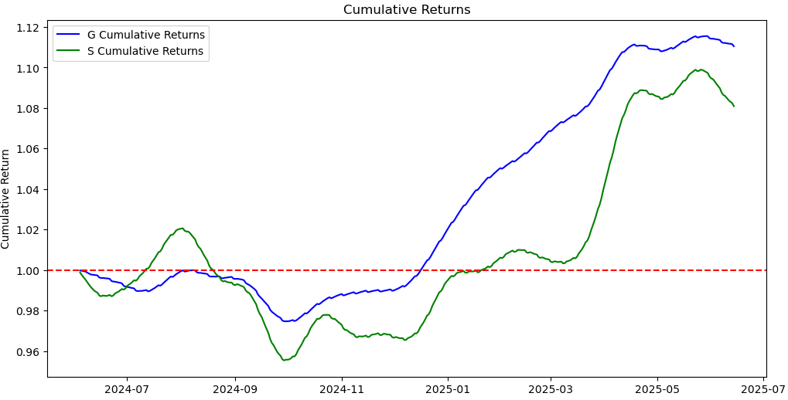

> 단기적으로는 GDX가 상승 할 것으로 보이지만 전체적인 수익률은 GLD가 좋아보인다  
> 변동률도 높고 수익성도 낮아보이는 GDX보다는 GLD투자가 정신건강에 좋아보인다.

<details>
  <summary>img</summary>


</details>

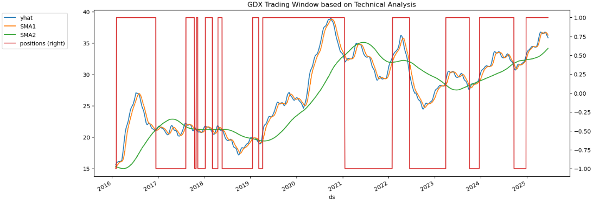

```
이왕 산다면 버티다가 25년 시작과 함께 산다면 좋을거같아 보인다.
```

<details>
  <summary>text</summary>

### 골드크로스 (Golden Cross)

-   **정의**: 골드크로스는 단기 이동 평균선이 장기 이동 평균선 위로 상승하여 교차하는 현상을 말합니다.
-   **시장 의미**: 이는 시장의 상승 추세가 시작될 수 있다는 강력한 신호로 간주됩니다. 일반적으로 이러한 신호는 불확실성이 해소되거나 시장이 긍정적인 방향으로 움직일 것이라는 투자자들의 신뢰를 반영합니다.
-   **예시**: 50일 이동 평균선이 200일 이동 평균선을 위로 돌파하는 경우.

### 데드크로스 (Dead Cross)

-   **정의**: 데드크로스는 단기 이동 평균선이 장기 이동 평균선 아래로 하락하여 교차하는 현상을 말합니다.
-   **시장 의미**: 이는 시장의 하락 추세가 시작될 수 있다는 강력한 신호로 해석됩니다. 투자자들 사이에 부정적인 전망이나 불안이 확산되고 있다는 신호일 수 있습니다.
-   **예시**: 50일 이동 평균선이 200일 이동 평균선 아래로 떨어지는 경우.

</details>
